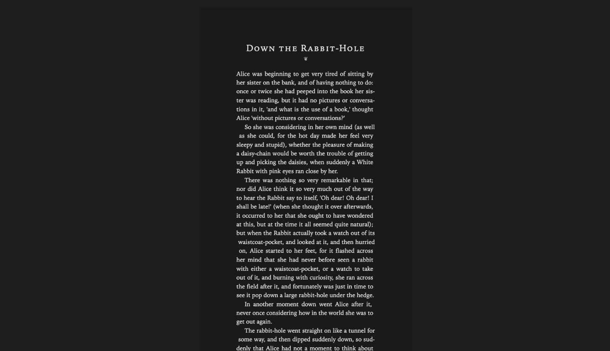
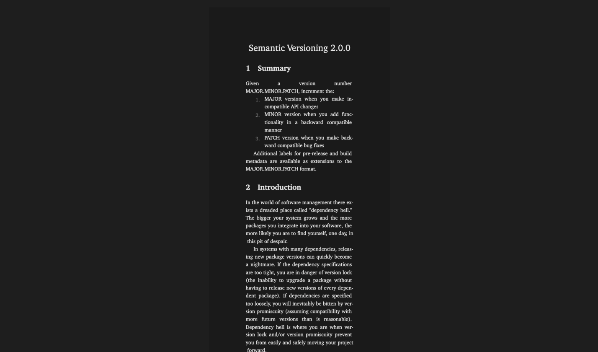
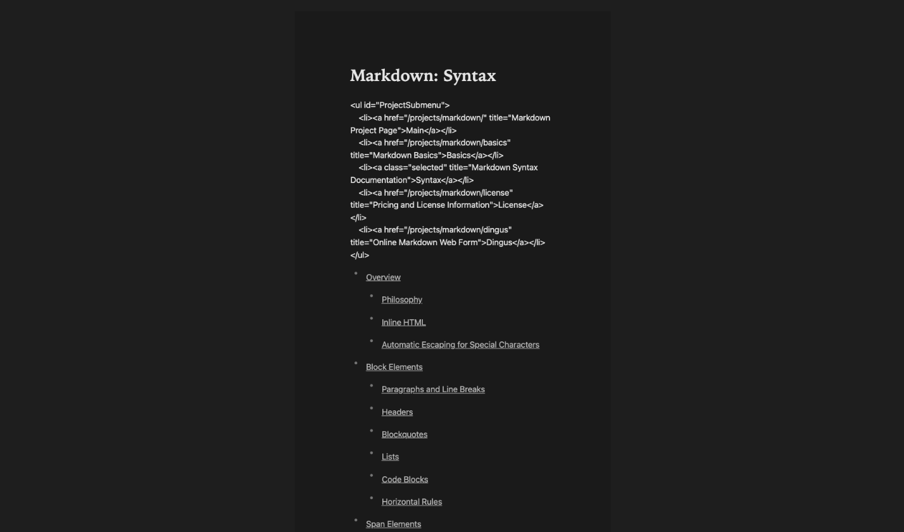
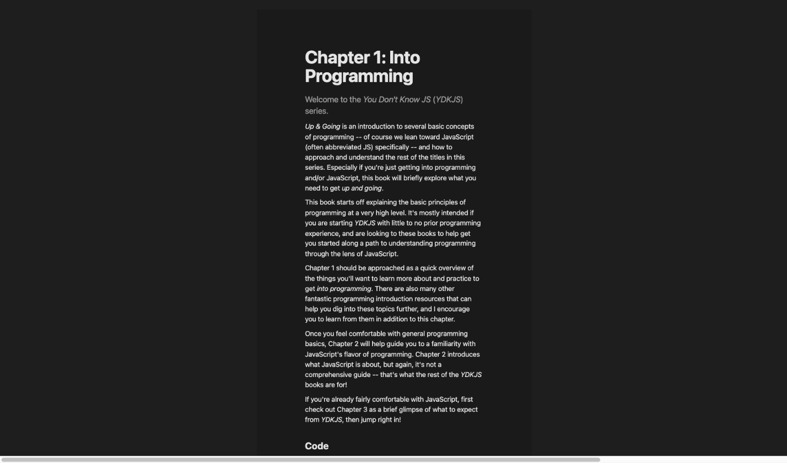

# Simple MD

A simple markdown viewer for macOS.
Local-only: find, render, critique, and edit markdown (and other text) files in a WYSIWYG editor, typeset properly.
Built for the workflow where an AI agent writes `.md` docs into repo worktrees and you need to read them fast - a ~6 MB app: paste a path or fuzzy-type a name, read it beautifully (mermaid included), edit, save.

## Rendering voices

The same markdown, four typographic traditions.
Voices are researched presets - trade-fiction book pages, LaTeX `article.cls` manners, magazine feature spreads - with every choice they make overridable through progressive controls.

| Novel | Paper |
| --- | --- |
|  |  |

| Standard | Magazine |
| --- | --- |
|  |  |

Specimens above: *Alice's Adventures in Wonderland* (Lewis Carroll, 1865), the [SemVer 2.0.0 spec](https://semver.org), [Gruber's original Markdown syntax doc](https://daringfireball.net/projects/markdown/syntax) (2004), and [*You Don't Know JS: Up & Going*](https://github.com/getify/You-Dont-Know-JS) ch. 1 (Kyle Simpson).

## Features

- Quick-open palette (`⌘P`): fuzzy search over a gitignore-aware index of your text files, live-updated by a filesystem watcher, cached across launches. Paste a nonexistent path to create the file.
- WYSIWYG editing via Milkdown Crepe with mermaid diagrams rendered inline; content-aware tables.
- Four rendering voices (Standard, Novel, Paper, Magazine) plus layered controls: fonts, width, zoom, then advanced overrides for heading case/alignment, paragraph style, justification (with implied hyphenation), density, section-break style (`---` as rule, dinkus, or fleuron), ornaments, and heading numbering.
- Light/dark/auto appearance driving the native window theme.
- Safe saves: atomic temp+rename writes with server-side mtime conflict detection - if an agent rewrote the file under your edits, you get a conflict bar (reload / overwrite), never a silent clobber. Clean editors auto-reload on focus.
- Multiple windows (`⌘N`); native macOS window tabbing applies.
- File associations for `.md`, `.markdown`, `.mdown`, `.mdx`, `.txt`.

## Usage

- `⌘P` / `⌘O` opens the quick-open palette; `⌘S` saves; `⌘⇧S` force-saves past a conflict; `⌘R` reloads from disk; `⌘N` opens a new window.
- Click the filename in the title bar to switch files; click the file count in the status bar to reindex.
- The `Aa` button opens the appearance panel.

## Search index

At startup the Rust side walks the configured roots (default: `~/Documents`, `~/Desktop`, `~/Downloads`), respecting `.gitignore`, and indexes text-document extensions (`md`, `markdown`, `mdx`, `txt`, `rst`, `adoc`, `org`), most-recently-modified first.
Roots are configurable in `~/Library/Application Support/co.useenso.simplemd/roots.json` as `{"roots": ["~/path", ...]}`.

## Custom typography

The Aa panel covers the common controls.
For unlimited depth, drop a `theme.css` beside `roots.json` - it loads after the built-in styles.
Hooks: voices are `#editor[data-voice="standard|novel|paper|magazine"]`; override attributes are `data-font`, `data-headings`, `data-heading-case`, `data-heading-align`, `data-heading-numbers`, `data-section-break`, `data-ornaments`, `data-paragraph`, `data-justify`, `data-density`.
Tokens: `--font-sans/-display/-newyork/-book/-charter/-mono`, `--voice-size`, `--voice-lh`, `--indent-depth`, `--content-width`, `--page-pad`, `--editor-zoom`.
A fifth personal voice is just CSS: style `#editor[data-voice="custom"]`.

## Stack

- Shell: [Tauri 2](https://tauri.app) (Rust core + macOS WKWebView).
- Editor: [Milkdown Crepe](https://milkdown.dev) (ProseMirror-based, markdown-first WYSIWYG).
- Diagrams: [mermaid](https://mermaid.js.org).
- Search: the `ignore` crate (ripgrep's walker) + `nucleo-matcher` (Helix's fuzzy matcher).

## Develop / build

```sh
pnpm install
pnpm tauri dev      # run in dev mode (also serves a browser demo at localhost:1420)
pnpm tauri build    # produce .app / .dmg in src-tauri/target/release/bundle
```

## License

MIT - see [LICENSE](LICENSE).
